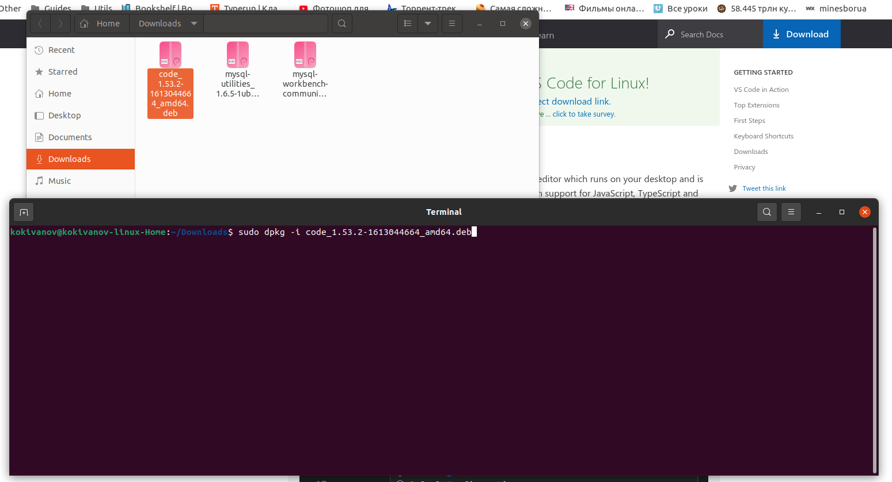
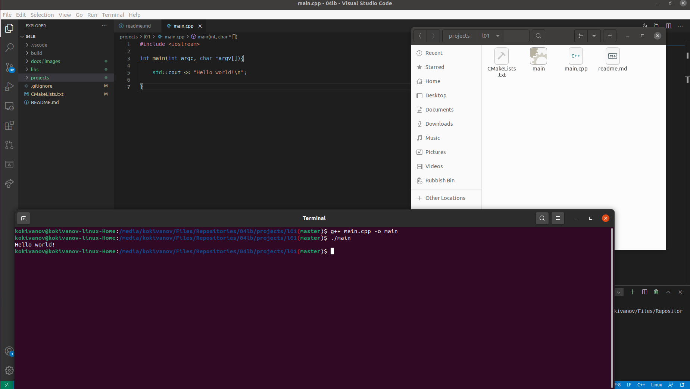

# Dmytryshyn Maksim

## 4th variant

### Task

* Installation Visual Studio (Visual Studio Code)
* Creating console applications with С++ in Visual Studio environmanet

### Result

**Installisation of VSCode from Debian package**

**Compiling main.cpp file and executing main file**
