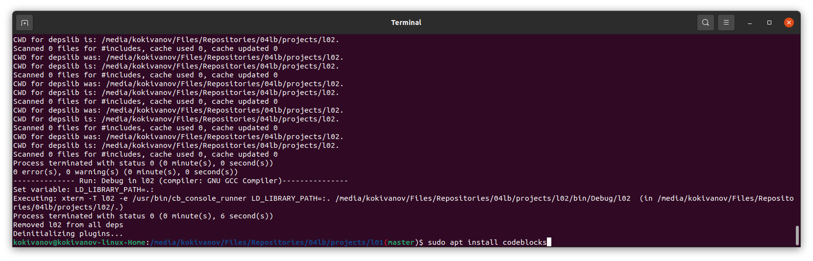
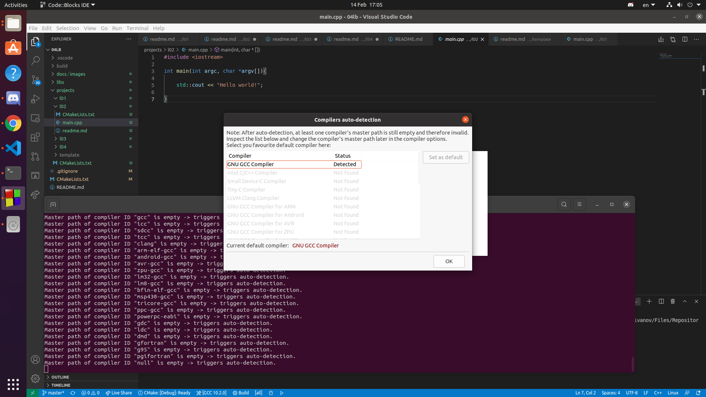
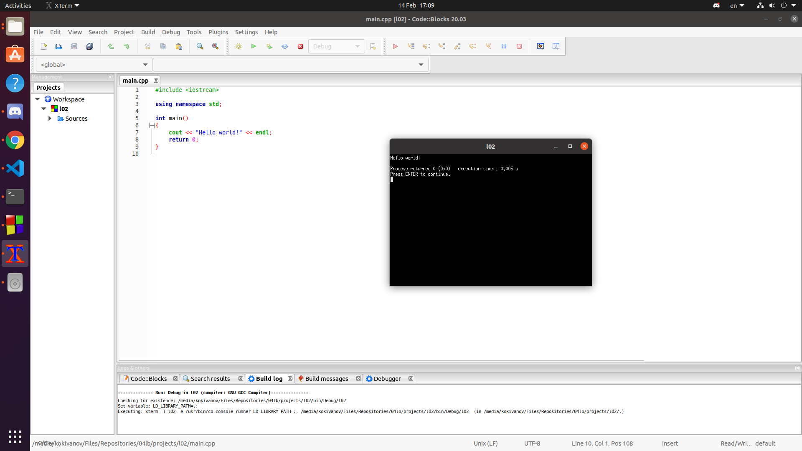

# Dmytryshyn Maksim

## 4th variant

### Task

* Installisation **MSys2** *(unnecessary)*
* Installisation **Code::Block**

### Result

**Installisation Code::Block**

**Running Code::Block with command** `$ codeblocks` **and selecting compiler** 

**Creating "Hello world!" application with Code::Blocks**
