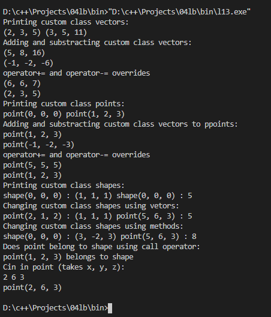

# Dmytryshyn Maksim

## 4th variant

### Task

* Creation of classes of subject area (lab 13)
* Overriding arithmetic and I/O operators (lab 15)
* Overriding call and index operators (lab 16)
* Creation of template classes (lab 21)

### Result

